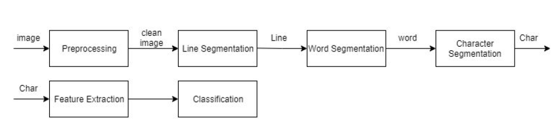
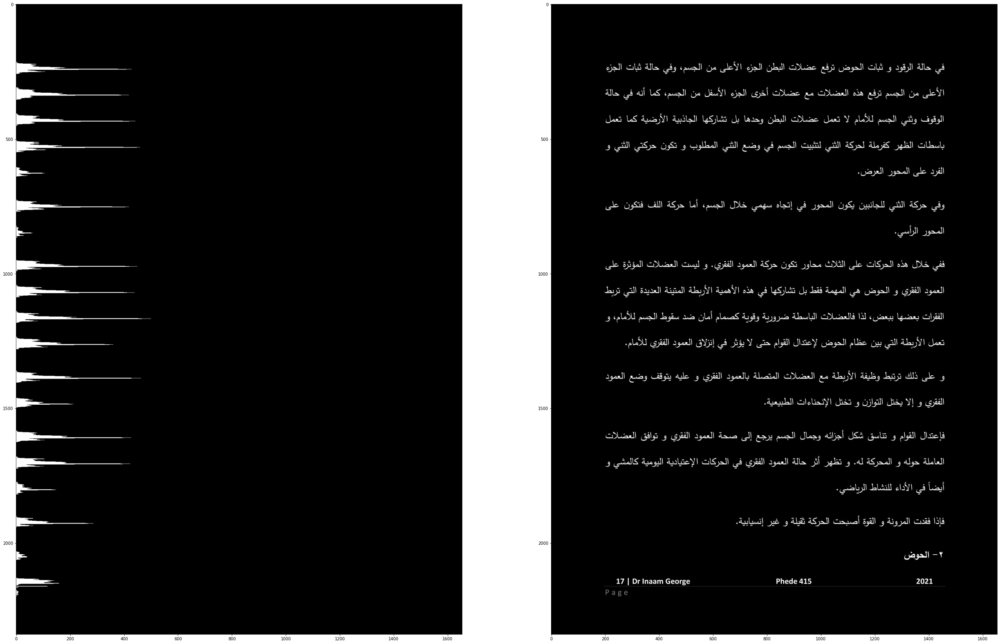
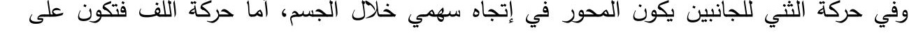
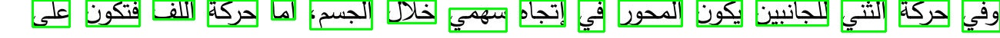

# Arabic OCR
This repository utilizes a number of algorithms and builds on top of them in order to find the best Algorithm for Arabic Optical Character Recognition.

### Difficulties 
Since most algortihms such as **Word Segementation** and **Character Segmentation** are available and finetuned to more mainstream languages, while very little attention is on the Arabic langauge in this subject. Arabic has been one of the most growing languages in the last decade and still going. The research on Arabic OCR is very little.

Some of the challenges we face with our OCR is character overlapping, some characters in Arabic can cause overlapping which results in bad segmentation. Some fonts can change the character structure fully, which forces us to increase the classes size, Arabic OCR usually contains 110-115 classes. Other languages may have 26-50 classes.

### Solution 
Using state of the art Computer Vision algoritms to detect characters and recognize them, by developing our own algorithms that fit the Arabic text properly. We follow the basic OCR flow to maintain a good accuracy. Check out the image below.

 

 

Below is the result of **Line Segmentation** on a page. Where region with the most populated black pixels is considered a splitting region.
 

 

Below image is the before and after applying **Word Segmentation** on a sentence from the page.

**Before**
 

 
  

**After**
 

